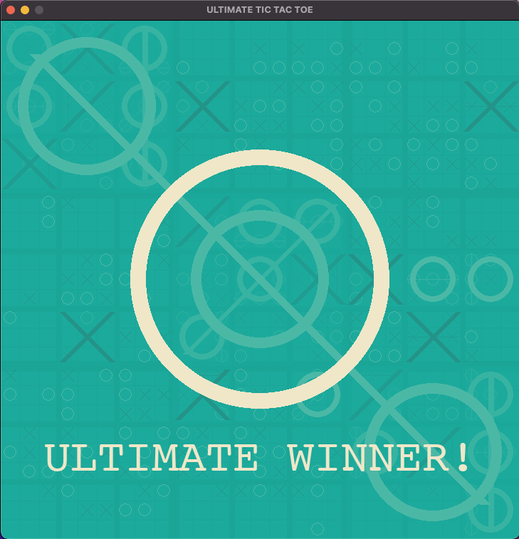

# Game Instructions

- Entry point: main.py
- Change game mode on main.py line 12 (classic, ultimate, max)
- Press 'r' to restart the game

# Game Snapshots

## Snapshot 1 - Classic Game Mode

## Snapshot 2 - Ultimate Game Mode

## Snapshot 3 - Max Game Mode

## Snapshot 4 - Max Board

## Snapshot 5 - Ultimate Win

